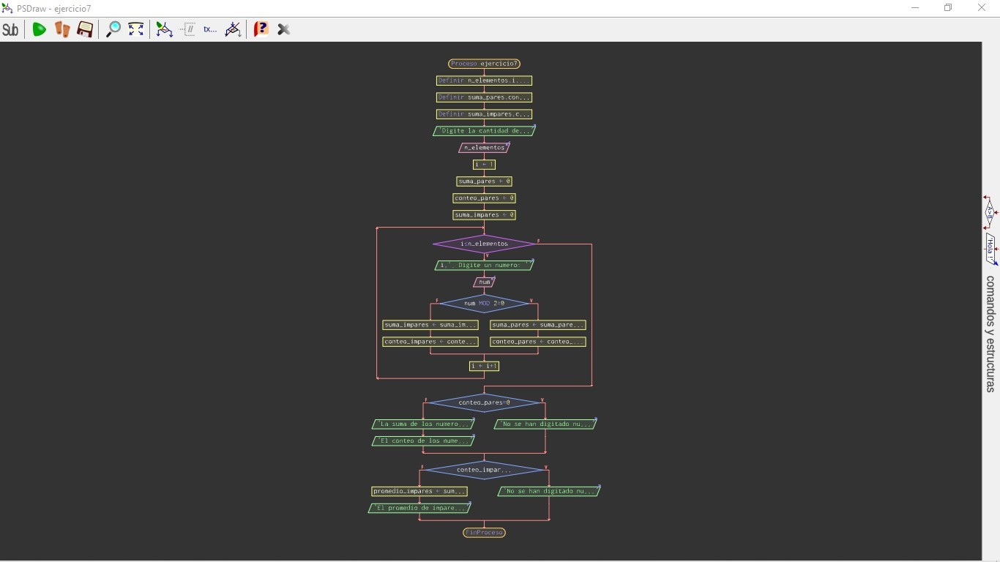

# Ejercicio clase 10
#
## Contar pares
     * realiza un algoritmo para que cuente los numeros pares qie ingresa el usuario.

[Algoritmo en Pselnt](https://github.com/federicopfund/Ingenieria-en-sistemas-de-la-informacion-UTN/blob/main/Ingreso%20Pselnt/Condicionales/Conteopares.psc)

  #
### Diagrama de flujo:

[Algoritmo en python](./factorial.py)
