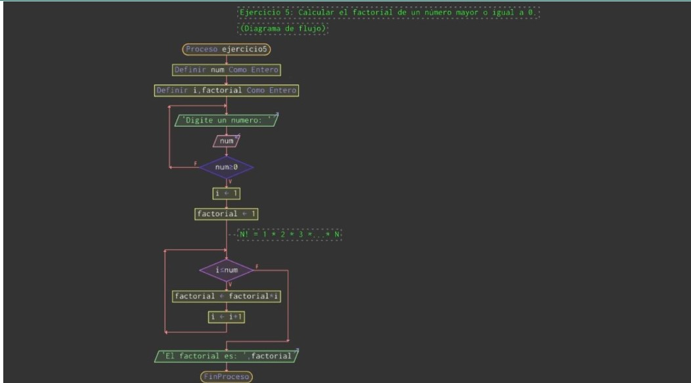

## Ejercicio clase 10
#
## Factoria
    * Calcular el factorial de un numero mayor o igual a 0.

[Algoritmo en python](./factorial.py)

## Terminos Nuevos
#
### Memoizacion

* Es una técnica de optimización que se usa principalmente para acelerar los tiempos de cálculo, almacenando los resultados de la llamada a una subrutina en una memoria intermedia o búfer y devolviendo esos mismos valores cuando se llame de nuevo a la subrutina o función con los mismos parámetros de entrada.

* La memoización también se puede usar en otras situaciones, y con propósitos diferentes del de reducir tiempos de computación, como por ejemplo en la recursión mutua de un analizador sintáctico o parser descendente.1​

* Aunque está fuertemente vinculada con el concepto de caché, la memoización se refiere a un uso específico de esta, distinguiéndose de otros casos de uso como un buffer o un algoritmo de reemplazo de páginas.

[Memoizacion](https://docs.python.org/es/3/library/functools.html#module-functools)