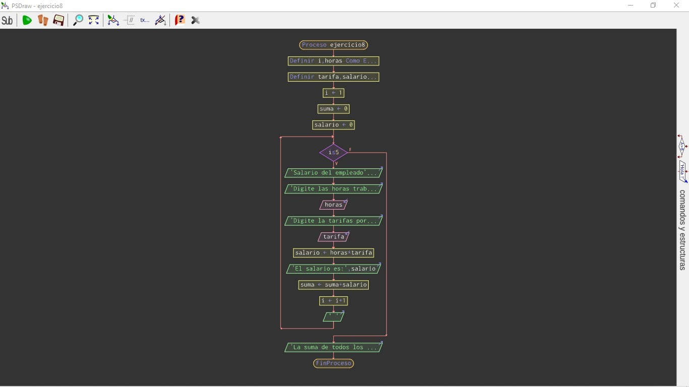

# Ejercicio clase 10
#
## Calcular salario
     * Raliza un algoritmo que calcule el salario de un empleado.

[Algoritmo en Pselnt](./fhttps://github.com/federicopfund/Ingenieria-en-sistemas-de-la-informacion-UTN/blob/main/Ingreso%20Pselnt/Condicionales/salario.psc)

  #
### Diagrama de flujo:

[Algoritmo en python](./salario.py)